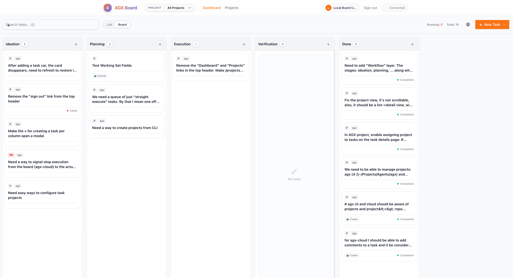

# AGX

**Autonomous Agent Orchestration for Developers.**

AGX transforms your favorite AI coding assistants into autonomous agents capable of executing complex tasks, managing their own state, and persisting work across sessions. It combines a powerful CLI for execution with a bundled visual dashboard for orchestration.



## Why AGX?

Most AI coding tools wait for you to type. AGX is active. You define the goal, and the agent works through a **Wake-Work-Sleep** cycle to achieve it:

1.  **Wake**: The agent receives a task with full context.
2.  **Work**: It executes commands, edits code, and validates output.
3.  **Sleep**: It yields state when blocked or finished, ready to resume later.

## Features

*   **Bundled Dashboard**: A visual Kanban board included with the CLI to manage tasks and track progress.
*   **Autonomous & Resumable**: Tasks persist across sessions. Agents can pause and resume exactly where they left off.
*   **Multi-Provider**: Use Claude, Gemini, or Ollama depending on your needs.
*   **Secure**: Runs locally with critical operation safeguards (`rm -rf` protection) and task signing.
*   **Project Workflows**: Define custom stage prompts tailored to your repository.

---

## ⭐ Star This Project

If AGX helps you build better software with AI agents, please **give us a star**! It helps others discover the project and motivates us to keep improving.

[](https://github.com/ramarlina/agx)

---

## Prerequisites

AGX requires:

- **PostgreSQL** - Local database for task persistence and queue management. AGX can **auto-start Postgres via Docker** if you don't have one running — just run any command and follow the prompt.
- **At least one AI provider CLI**:
  - **[Claude Code](https://docs.anthropic.com/claude/docs/claude-cli)** - Anthropic's CLI for Claude
  - **[Gemini CLI](https://ai.google.dev/gemini-api/docs/cli)** - Google's CLI for Gemini models
  - **[Ollama](https://ollama.ai/)** - Local LLM runtime

PostgreSQL and the board server are auto-started on demand — no manual setup required.

---

## Getting Started

### Installation

AGX is distributed via npm. Install it globally:

```bash
npm install -g @mndrk/agx
```

### Usage

1.  **Initialize a Project**
    ```bash
    cd my-project
    agx init
    ```

2.  **Run an Agent**
    Create a new task and let the agent take over. The board server and Postgres are started automatically if needed:
    ```bash
    agx new "Refactor the authentication middleware"
    agx run <task>
    ```

---

## Commands

### Task Management

```bash
agx init               # Initialize AGX in current directory
agx new "<goal>"       # Create a new task
agx run <task_id>      # Run a specific task
agx status             # Show current status
```

### Board Server

The board server (agx-cloud) starts automatically when you run any command that needs it. You can also manage it manually:

```bash
agx board start        # Start the board server (auto-starts Postgres if needed)
agx board stop         # Stop the board server
agx board status       # Check if board is running
agx board logs         # Show recent board logs
agx board tail         # Live tail board logs
```

### Daemon Mode

Run a background worker to poll for tasks from the queue:

```bash
agx daemon start       # Start background worker
agx daemon stop        # Stop the daemon and board server
agx daemon status      # Check daemon/worker/board status
```

### One-Shot Mode

For quick questions without creating a persistent task:

```bash
agx -p "Explain this error"
agx claude -p "Refactor this function"
agx gemini -p "Debug this code"
```

---

## Providers

| Provider | Alias | Command |
|----------|-------|---------|
| **Claude** | `c` | `agx claude` or `agx c` |
| **Gemini** | `g` | `agx gemini` or `agx g` |
| **Ollama** | `o` | `agx ollama` or `agx o` |

## Key Flags

```bash
-a, --autonomous    # Full auto: create task + daemon + work until done
-p, --prompt        # The prompt/goal
-y, --yolo          # Skip confirmation prompts
-P, --provider      # Specify provider (c|g|o) for new tasks
```

---

## Workflows

AGX supports project-specific workflows. You can define custom prompts for each stage of the SDLC pipeline (Planning, Coding, QA, etc.) to tailor agent behavior.

Use `agx workflow` to manage workflow configurations for your project.


---

## Architecture

AGX uses a split-plane architecture to manage autonomous agents locally.

```
┌─────────────────────────────────────────────────────────────────┐
│                   Control Plane (Orchestration)                 │
│                                                                 │
│   ┌──────────────┐       ┌──────────────┐      ┌────────────┐ │
│   │  AGX Board   │◄─────►│ PostgreSQL   │◄────►│  pg-boss   │ │
│   │  (Next.js)   │       │   Database   │      │ Task Queue │ │
│   └──────────────┘       └──────┬───────┘      └─────▲──────┘ │
│                                 │                     │         │
└─────────────────────────────────┼─────────────────────┼─────────┘
                                  │                     │
                                  │                   Polls
┌─────────────────────────────────┼─────────────────────┼─────────┐
│                                 │                     │         │
│                   Data Plane (Execution)              │         │
│                                 │                     │         │
│   ┌──────────────┐       ┌──────▼───────┐      ┌─────▼──────┐ │
│   │  AI Provider │◄──────│   AGX CLI    │◄─────│ AGX Daemon │ │
│   │ Claude/Gemini│ Calls │              │ Exec │            │ │
│   │   /Ollama    │       └──────────────┘      └────────────┘ │
│   └──────────────┘                                            │
│                                                                 │
└─────────────────────────────────────────────────────────────────┘
```

### Control Plane vs. Data Plane

- **Control Plane**: Managed via `agx board`. It handles task creation, workflow definitions, and monitoring. It stores state in a local PostgreSQL database and uses `pg-boss` for reliable task distribution. The board server auto-starts when any CLI command needs it.
- **Data Plane**: Managed via `agx run` or `agx daemon`. This is where the actual work happens. The CLI interacts with your local AI providers and updates the task state in the database.

## Under the Hood: Local Sessions

Most AI tools lose context the moment the process ends. AGX solves this through **Persistent Local Sessions**:

1.  **State Checkpointing**: After every tool call or model iteration, AGX serializes the entire agent state (including memory, working set, and logs) to the local database.
2.  **Atomic Updates**: Transitions between SDLC stages are atomic, ensuring that if a process is interrupted, it can resume from the exact last successful checkpoint.
3.  **Resume Anywhere**: Run `agx run --continue <id>` on any machine with access to the database to pick up exactly where the agent left off.

## Tech Stack

AGX is built with a modern, local-first stack:

*   **Frontend**: Next.js 15, Tailwind CSS 4, Lucide React.
*   **Database**: PostgreSQL with `pg-boss` for background job processing.
*   **Runtime**: Node.js (with `tsx` for type-safe execution).
*   **Communication**: EventSource for real-time log streaming from CLI to Board.

---

## Contributing to agx

We love your input! We want to make contributing to `agx` as easy and transparent as possible, whether it's:

- Reporting a bug
- Discussing the current state of the code
- Submitting a fix
- Proposing new features

### We use GitHub Flow

We use GitHub to host code, to track issues and feature requests, as well as accept pull requests.

### How to Contribute

#### 1. Ideas & Questions -> GitHub Discussions
Have a vague idea? A "what if"? A question about how something works?
👉 **Start in [GitHub Discussions](https://github.com/mndrk/agx/discussions)**

This keeps our Issue tracker clean and focused on actionable items.

#### 2. Bugs & Concrete Features -> GitHub Issues
Found a bug? Have a specific, actionable feature request?
👉 **Open a [GitHub Issue](https://github.com/mndrk/agx/issues)**

**Please use our Issue Templates:**
- **Bug Report:** Tell us what happened, what you expected, and how to reproduce it.
- **Feature Request:** Describe the problem you are solving, not just the solution.

#### 3. The Label System
We use labels to communicate status and intent. Key labels to know:

*   **Type:** `bug`, `feature`, `question`, `proposal`
*   **Status:**
    *   `needs-repro`: We can't fix it if we can't see it.
    *   `needs-design`: Good idea, but needs a plan before coding.
    *   `blocked`: Waiting on something else.
    *   `help-wanted`: We'd love your help on this!
    *   `good-first-issue`: Great for new contributors.
*   **Reality Checks:** `won't-fix`, `out-of-scope`.

#### 4. Pull Requests
1.  Fork the repo and create your branch from `main`.
2.  If you've added code that should be tested, add tests.
3.  Ensure the test suite passes.
4.  Make sure your code lints.
5.  Issue that Pull Request!

### Triage Cadence
We triage issues **weekly**. If you don't hear back immediately, don't worry—we'll get to it.

### License
By contributing, you agree that your contributions will be licensed under its MIT License.

---

## License

MIT
