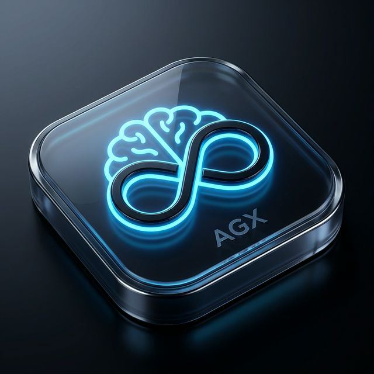
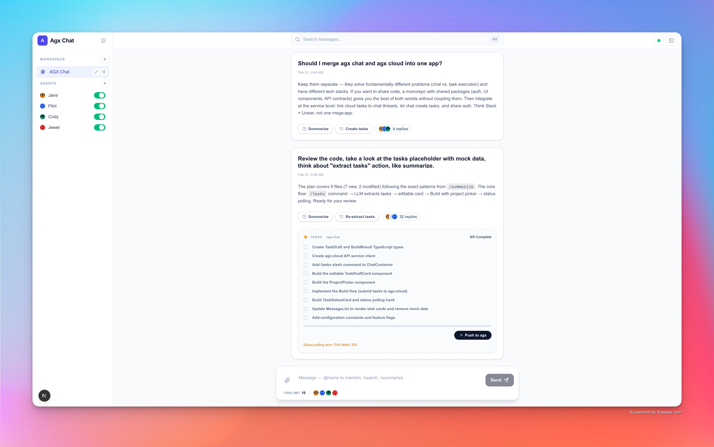

<p align="center">
  <br>
  
</p>

<p align="center">
  <strong>Your AI team's command center.</strong><br>
  Chat with AI agents. Watch them plan. Approve before they act.<br>
  All running locally on your machine.
</p>

<p align="center">
  <a href="https://www.npmjs.com/package/@mndrk/agx"></a>
  <a href="https://www.npmjs.com/package/@mndrk/agx"></a>
  <a href="https://github.com/ramarlina/agx/stargazers"></a>
  <a href="LICENSE"></a>
</p>

<p align="center">
  <a href="https://www.npmjs.com/package/@mndrk/agx">NPM</a> •
  <a href="#quick-start">Quick Start</a> •
  <a href="#features">Features</a> •
  <a href="#commands">Commands</a> •
  <a href="#how-it-works">How It Works</a> •
  <a href="#contributing">Contributing</a>
</p>

---

## What is AGX?

AGX started as a **CLI-first multi-agent execution engine** and is evolving into **your AI team's command center**. Drop an idea into a chat, let agents debate and plan, route work into execution, and approve before they act, all locally on your machine.

<p align="center">
  <a href="https://github.com/ramarlina/agx">
    
  </a>
</p>

---

## Quick Start

```bash
npm install -g @mndrk/agx
cd my-project
agx init
```

### Start a multi-agent chat

```bash
agx chat            # Start server + open in browser
agx chat start      # Start server only (headless)
agx chat stop       # Stop the chat server
```

Drop an idea, @mention agents, let them plan. When ready, push tasks to the board.

### Run tasks autonomously

```bash
agx new "Refactor the authentication middleware"
agx daemon start
```

Open the board, watch the agent work, approve gates, stop/restart at will.

---

## Features

- **Multi-agent chat** — Talk to Claude, Codex, Gemini, or Ollama in the same thread. @mention agents, get multiple perspectives, steer the conversation.
- **Execution graphs** — Tasks run as dynamic graphs, not fixed linear stages. Branch, fork, join — the graph is a map of decisions, not a to-do list.
- **Human-in-the-loop gates** — Critical nodes pause for your explicit `approve` / `reject`. Agents do the heavy lifting; you stay in control.
- **Durable, resumable execution** — Tasks survive restarts, crashes, and reboots. State is checkpointed, not rebuilt from history.
- **Bundled dashboard (Kanban)** — Ships with the CLI. Chat is the thinking; board is the doing.
- **Multi-provider** — Claude, Codex, Gemini, Ollama. Use whatever fits.
- **Local & inspectable** — Runs entirely on your machine. Full execution logs, task signing, safeguards for destructive commands.

---

## What AGX is *not*

- Not just a chatbot
- Not a hosted SaaS
- Not prompt-replay-based
- Not a black-box agent framework

AGX is infrastructure for running agents **locally, durably, and observably**.

---

## Commands

### Chat

```bash
agx chat                       # Start server + open chat in browser
agx chat start                 # Start chat server (no browser)
agx chat start --open          # Start chat server + open in browser
agx chat open                  # Open chat in browser (starts server if needed)
agx chat stop                  # Stop the chat server
```

### Setup

```bash
agx init                       # First-time setup wizard
agx config                     # Reconfigure providers, models, backend URL
```

### Task Management

```bash
agx new "<goal>"                                 # Create a new task
agx run <task_id>                               # Run a specific task
agx status [task-id-or-slug]                    # Show status
agx retry <task_id-or-slug> [--from <stage>]    # Reset + retry
agx approve <task> [--node <node-id>] [-m "feedback"]  # Approve a gate
agx reject <task> [--node <node-id>] [-m "feedback"]   # Reject a gate
agx deps <task> [--depends-on <task> ... | --clear]    # Manage dependencies
```

### Board & Daemon

```bash
agx board start        # Start the dashboard
agx daemon start       # Start background worker
agx daemon stop        # Stop daemon and board
```

### Projects & Repos

```bash
agx project list                           # List projects
agx repo add . --project my-project        # Analyze current repo and attach it to a project
agx repo add ../service --project my-project --name API
```

### One-Shot Mode

```bash
agx -p "Explain this error"
agx claude -p "Refactor this function"
agx codex -p "Propose a migration plan"
```

---

## Providers

| Provider | Alias | Command      |
| -------- | ----- | ------------ |
| Claude   | `c`   | `agx claude` |
| Codex    | `x`   | `agx codex`  |
| Gemini   | `g`   | `agx gemini` |
| Ollama   | `o`   | `agx ollama` |

---

## Key Flags

```bash
-p, --prompt        # Task goal
-P, --provider      # c | x | g | o
-m, --model         # Explicit model for provider commands
-a, --autonomous    # Create task + start daemon + run until done
-y, --yolo          # Skip confirmations during execution (implied by -a)
--swarm             # Multi-agent swarm execution mode
```

---

## Prerequisites

- **Node.js** >= 18
- **At least one AI provider CLI:**
  - [Claude Code](https://docs.anthropic.com/claude/docs/claude-cli)
  - [OpenAI Codex CLI](https://www.npmjs.com/package/@openai/codex)
  - [Gemini CLI](https://ai.google.dev/gemini-api/docs/cli)
  - [Ollama](https://ollama.ai/)

No external database required. AGX uses SQLite locally.

---

## How It Works

AGX treats agent memory as **durable state**, not conversation history.

Agents follow a **Wake → Work → Sleep** cycle:

1. **Wake** — Load full context from checkpointed state
2. **Work** — Execute commands, edit files, validate output
3. **Sleep** — Checkpoint state and yield, ready to resume

Resuming a task is a constant-cost operation, no matter how long it has been running.

### Architecture

```
┌──────────────┐   ┌──────────────┐   ┌────────────┐
│ AGX Board    │◄─►│ SQLite       │◄─►│ Task Queue │
│ (Next.js)    │   │ Durable State│   │            │
└──────────────┘   └──────────────┘   └────────────┘

┌──────────────┐   ┌──────────────┐   ┌────────────┐
│ AI Provider  │◄─►│ AGX CLI      │◄─►│ AGX Daemon │
│ C/Codex/G/O  │   │              │   │            │
└──────────────┘   └──────────────┘   └────────────┘
```

- **State layer** — SQLite (WAL mode), durable checkpoints, task queueing
- **Execution layer** — CLI + daemon, provider tool calls, filesystem edits
- **Decision layer** — Execution graph runtime + human gate transitions

---

## Tech Stack

* **Frontend:** Next.js, Tailwind CSS
* **Database:** SQLite (WAL mode)
* **Runtime:** Node.js (TypeScript / `tsx`)
* **Streaming:** EventSource (CLI → board)

---

## Contributing

Contributions welcome.

* **Ideas & questions:** GitHub Discussions
* **Bugs & features:** GitHub Issues
* **PRs:** Fork `main`, add tests, submit

---

## Telemetry

**Telemetry is enabled by default.**

AGX collects anonymous usage data to improve the tool. Here's exactly what we collect:

| Data | Example |
|------|---------|
| OS & architecture | `darwin`, `arm64` |
| Node.js version | `v20.10.0` |
| AGX version | `1.4.55` |
| Commands run | `new`, `daemon start` |
| Provider used | `claude`, `codex`, `gemini`, `ollama` |
| Task outcomes | `completed`, `failed` |
| Timing | `duration_ms: 12345` |

**We do NOT collect:** prompts, code, API keys, file paths, or any PII.

### Disable telemetry

```bash
agx telemetry off
# or: export AGX_TELEMETRY=0
# or: ~/.agx/config.json → { "telemetry": { "enabled": false } }
```

---

## License

MIT

---

<p align="center">
  <strong>Not a chatbot. Your AI team's command center.</strong>
</p>
